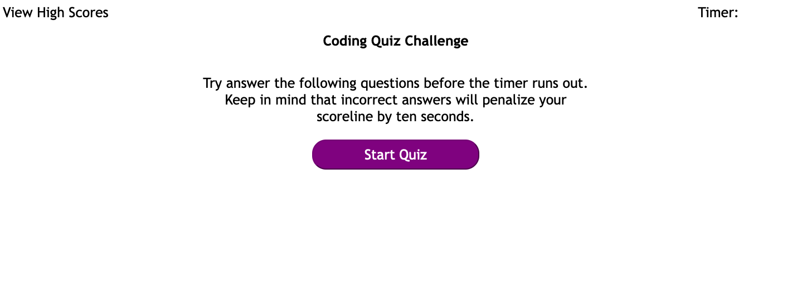

# Web APIs Questionnaire

## Building a Web API questionnaire

The purpose of this project is to created a a interactive quiz. Developing this project demonstrates our programming skills.
This project was developed with javascript. It was important that the Web API Questionnaire worked. I learnt that some "trail and error" was necessary.  

The following is an image of the password generator.
 

## Installation

N/A

## Usage

To take the quiz, simply click the following link: https://gah-mewbittik.github.io/web-apis-questionnaire/
From there you will be able view the quiz and simply click the "Start Quiz" button to begin the quiz. Then the first question will display requiring to select one of four choices. After selecting your answer, your move on to the next question. This process repeats until you complete the quiz. Once completing the quiz, your score is calculated
and are asked to input your initials. 

## Credits

N/A

## License

Please refer to the LICENSE in the repo.